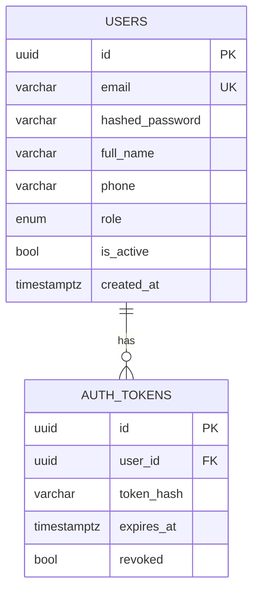
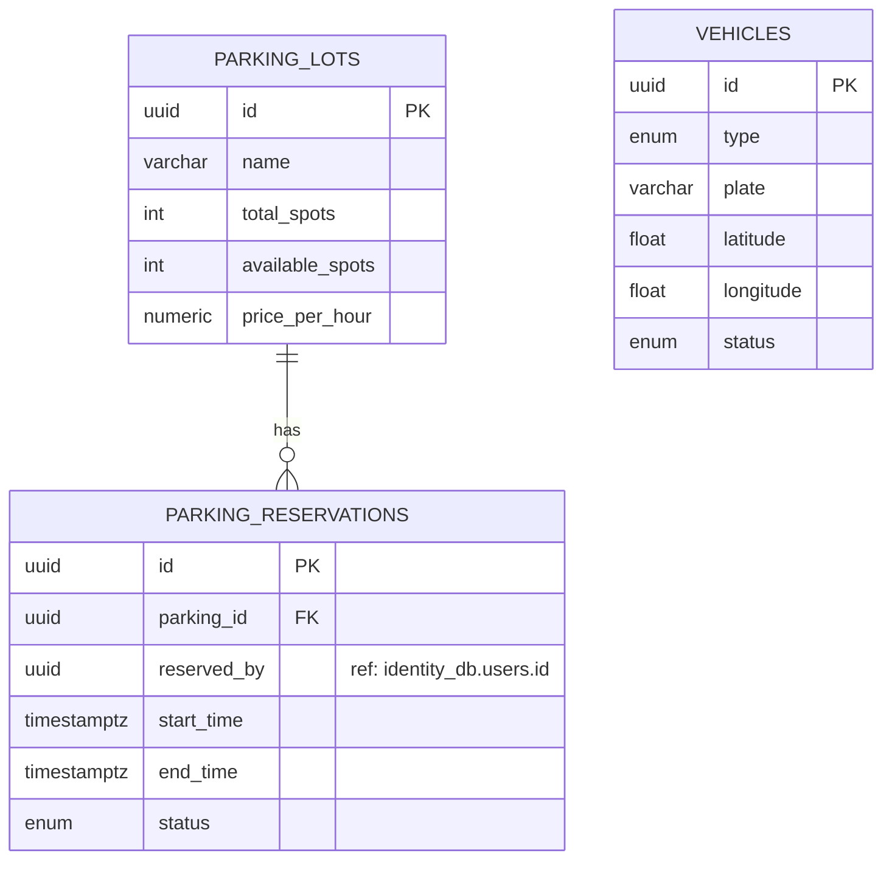
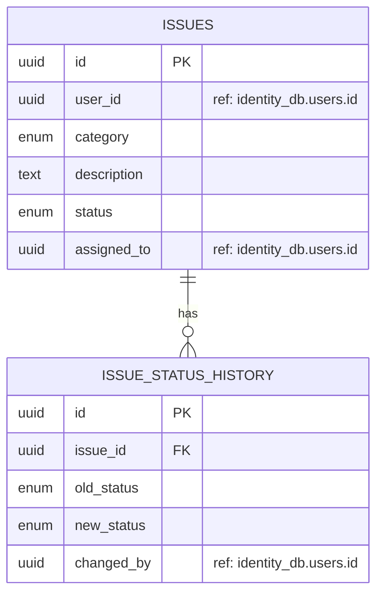
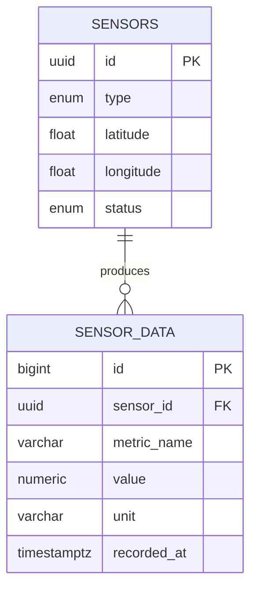
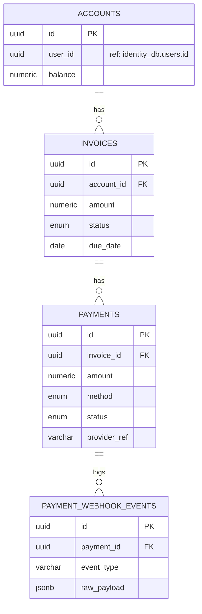
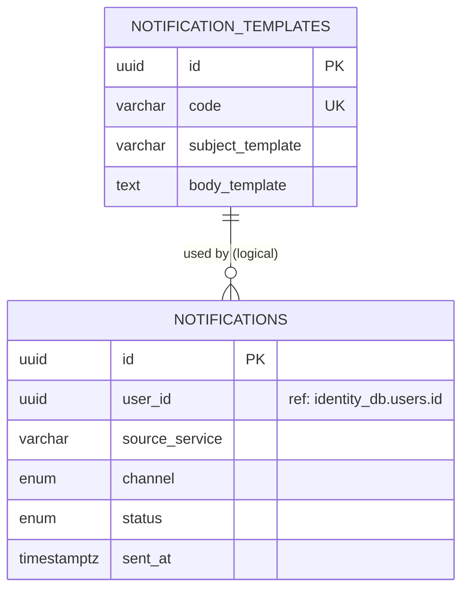
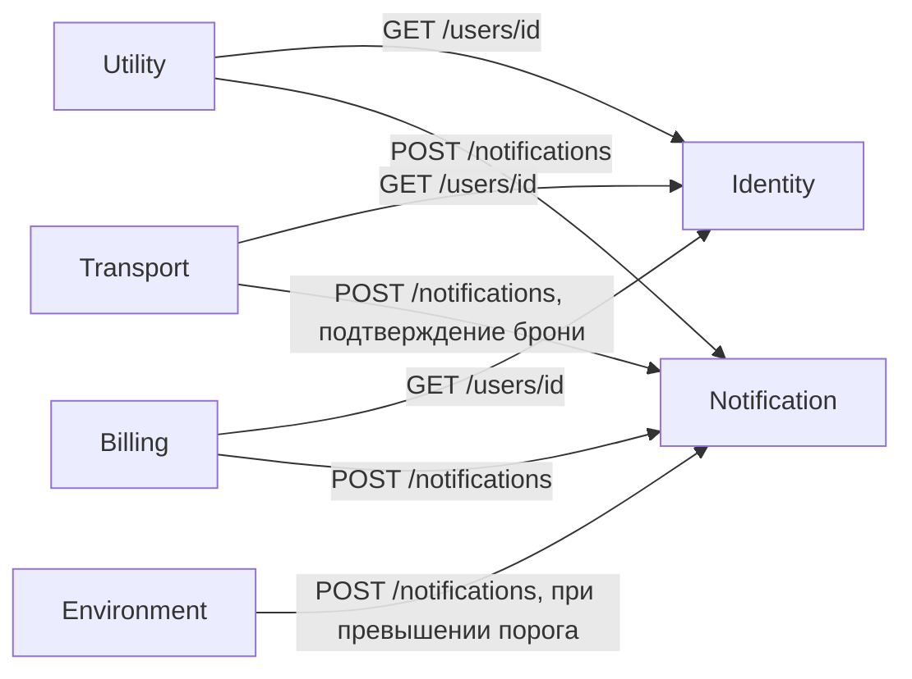

# Проектирование баз данных — «Умный город»

## Принцип: Database per Service

Каждый микросервис владеет **собственной изолированной базой** PostgreSQL.
Прямые SQL-соединения между базами разных сервисов запрещены.
Если сервису А нужны данные сервиса Б — он делает HTTP-запрос к API сервиса Б.

Поэтому все "внешние ключи" на пользователя (`user_id`) в БД Transport,
Utility, Environment, Billing и Notification — это **логические ссылки без
физического FOREIGN KEY** на таблицу `users` (та живёт в другой базе).
Целостность таких ссылок обеспечивается на уровне приложения — сервис
проверяет существование пользователя вызовом `GET /users/{id}` к
Identity & Auth Service.

## Карта баз данных

| Сервис               | База данных         | Ключевые таблицы                                              |
|-----------------------|----------------------|----------------------------------------------------------------|
| Identity & Auth        | `identity_db`        | users, auth_tokens                                             |
| Transport              | `transport_db`       | vehicles, parking_lots, parking_reservations                   |
| Utility                | `utility_db`         | issues, issue_status_history                                   |
| Environment             | `environment_db`     | sensors, sensor_data                                            |
| Billing & Payment       | `billing_db`         | accounts, invoices, payments, payment_webhook_events            |
| Notification            | `notification_db`    | notifications, notification_templates                          |

## ER-диаграммы (Mermaid)

### Identity & Auth Service


### Transport Service


### Utility Service


### Environment Service


### Billing & Payment Service


### Notification Service


## Межсервисные зависимости (кто кого вызывает по HTTP)



## Обоснование выбора типов и ограничений

- **UUID вместо SERIAL** для первичных ключей сущностей, которыми обмениваются
  сервисы (`users.id`, `issues.id`, `vehicles.id` и т.д.) — исключает угадывание
  идентификаторов и коллизии при распределённой генерации.
- **ENUM-типы** для статусов (`issue_status`, `payment_status` и т.п.) — валидация
  на уровне БД плюс самодокументируемость схемы.
- **CHECK-ограничения** (например, `end_time > start_time`, `amount > 0`) —
  защита от некорректных данных ещё до попадания в бизнес-логику.
- **JSONB** в `payment_webhook_events.raw_payload` — гибкое хранение сырых
  вебхуков от внешнего платёжного провайдера без потери данных для аудита.
- Каждая таблица с изменяемым состоянием имеет `created_at`/`updated_at`
  (или отдельную таблицу истории, как `issue_status_history`) для аудита.

## Файлы архива

```
db-design/
├── README.md                      (этот файл + ER-диаграммы)
├── identity-auth/schema.sql
├── transport/schema.sql
├── utility/schema.sql
├── environment/schema.sql
├── billing-payment/schema.sql
└── notification/schema.sql
```
